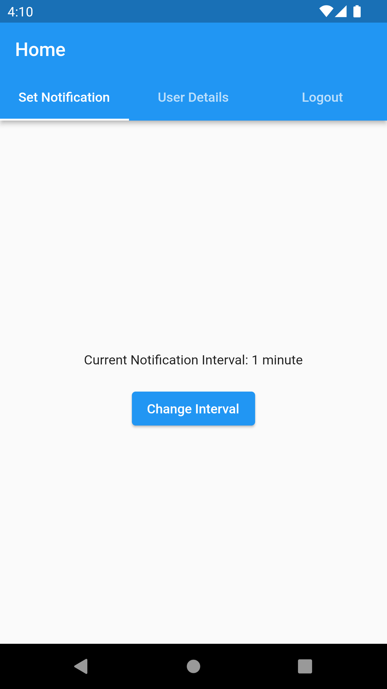

# Email and password Authentication via Firebase in Flutter

Create Email and password Authentication via Firebase in Flutter

## ScreenShots

|  |   |  |  |   | 

---
## Getting Started

This project is a starting point for a Flutter application.

- Clone repo and set dart SDK plugin
- Create a Firebase project
- Download the Firebase Google JSON file and save it inside the app folder
- Task :
-  1. Authenticating user using Firebase.
-  2. Create a cron job that triggers notifications based on a configured interval.
-  3. Once the notification is generated, the user should take action to enter the details after clicking on the notification popup.All the data entered by user is stored in the firebase cloud database. 
-  4. In tab 2 of the page, we need to fetch all the information entered by the user.
  

---
## Technologies and versions used :

- Flutter: 3.13.0 
- Java Development kit: 11.0 
- Device version: Android 11 - R -31
- Dart SDK: 3.1.0

---
## To start the application :

- Build grade 
- Setup firebase - create database and setup user Authentication
- Add Dart sdk in android studio
- Have java version installed 
- **flutter run** command to start the application
